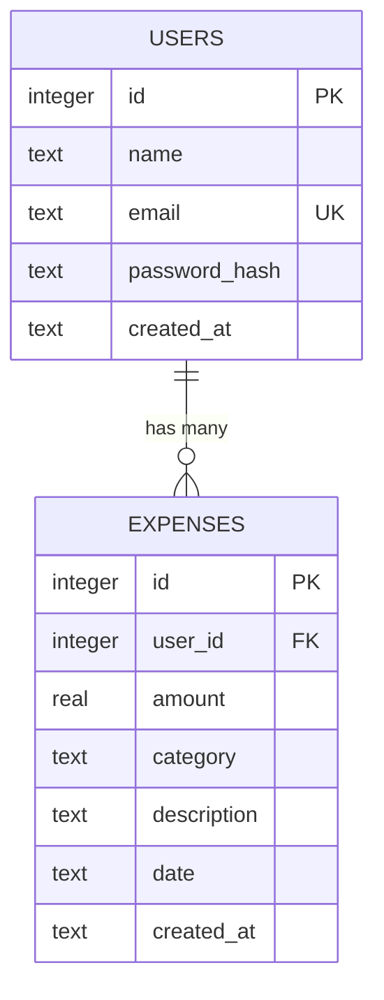

# Step 1 — Database Setup Spec (Spendly)

This spec defines the SQLite schema and the three functions `database/db.py` needs — `get_db()`, `init_db()`, `seed_db()` — so it can be implemented (by you or by Claude Code) without guessing at the design. It's grounded entirely in what's already committed in this repo, not invented from scratch.

## Grounding

- `database/db.py`'s own stub comment already names the contract: `get_db()`, `init_db()`, `seed_db()`.
- `templates/privacy.html` already tells users exactly what's stored: *"your name, email address, and password (stored only in hashed form)... expense records... amounts, categories, dates, and descriptions."* The schema below matches that, and nothing more.
- `templates/register.html` posts `name`, `email`, `password` to `/register`. `templates/login.html` posts `email`, `password` to `/login`. Both templates already have an `` block wired up, waiting for a route to pass an `error=` message.
- `CLAUDE.md`'s tech constraints: raw `sqlite3`, no ORM, DB filename `expense_tracker.db` (already in `.gitignore`), no new dependencies.

## Schema

Two tables. A user has many expenses.



### `users`

| Column | Type | Constraints | Notes |
|---|---|---|---|
| `id` | INTEGER | PRIMARY KEY AUTOINCREMENT | |
| `name` | TEXT | NOT NULL | from the register form |
| `email` | TEXT | NOT NULL, UNIQUE | login identifier |
| `password_hash` | TEXT | NOT NULL | never store plaintext — see seed data note below |
| `created_at` | TEXT | NOT NULL, default now | ISO 8601 timestamp |

```sql
CREATE TABLE IF NOT EXISTS users (
    id            INTEGER PRIMARY KEY AUTOINCREMENT,
    name          TEXT NOT NULL,
    email         TEXT NOT NULL UNIQUE,
    password_hash TEXT NOT NULL,
    created_at    TEXT NOT NULL DEFAULT (datetime('now'))
);
```

### `expenses`

| Column | Type | Constraints | Notes |
|---|---|---|---|
| `id` | INTEGER | PRIMARY KEY AUTOINCREMENT | |
| `user_id` | INTEGER | NOT NULL, FK → `users.id` | owner |
| `amount` | REAL | NOT NULL | see open questions below |
| `category` | TEXT | NOT NULL, CHECK constraint | fixed list of 7 values, enforced in SQLite via `CHECK` — see Categories section below |
| `description` | TEXT | nullable | optional, per the add-expense form coming in Step 7 |
| `date` | TEXT | NOT NULL | ISO 8601 `YYYY-MM-DD` — sorts correctly as plain text |
| `created_at` | TEXT | NOT NULL, default now | row-insert timestamp, separate from user-chosen `date` |

```sql
CREATE TABLE IF NOT EXISTS expenses (
    id          INTEGER PRIMARY KEY AUTOINCREMENT,
    user_id     INTEGER NOT NULL,
    amount      REAL NOT NULL,
    category    TEXT NOT NULL CHECK (category IN ('Food', 'Transport', 'Bills', 'Health', 'Entertainment', 'Shopping', 'Other')),
    description TEXT,
    date        TEXT NOT NULL,
    created_at  TEXT NOT NULL DEFAULT (datetime('now')),
    FOREIGN KEY (user_id) REFERENCES users (id) ON DELETE CASCADE
);

CREATE INDEX IF NOT EXISTS idx_expenses_user_id   ON expenses (user_id);
CREATE INDEX IF NOT EXISTS idx_expenses_user_date ON expenses (user_id, date);
```

`ON DELETE CASCADE` only takes effect if `PRAGMA foreign_keys = ON` is active on the connection — SQLite has it off by default per-connection, which is why `get_db()` sets it every time below.

## Categories (fixed list)

`expenses.category` is constrained to exactly these seven values via the `CHECK` constraint above — no lookup table, no free text:

- Food
- Transport
- Bills
- Health
- Entertainment
- Shopping
- Other

Any insert/update with a category outside this list fails at the database layer (`sqlite3.IntegrityError`), not just in application code.

## `database/db.py` — function specs

### `get_db()`

```python
def get_db():
    conn = sqlite3.connect("expense_tracker.db")
    conn.row_factory = sqlite3.Row
    conn.execute("PRAGMA foreign_keys = ON")
    return conn
```
- Opens a new connection each call — no pooling/caching needed at this scale.
- `expense_tracker.db` resolves relative to the working directory the app runs from (repo root, per the `python app.py` command in `CLAUDE.md`).
- Caller closes it (`conn.close()`) when done. Note: using a connection as a `with` block auto-commits/rolls back but does **not** auto-close it — that trips people up.

### `init_db()`

```python
def init_db():
    conn = get_db()
    conn.executescript("""
        -- the CREATE TABLE / CREATE INDEX statements from the Schema section
    """)
    conn.commit()
    conn.close()
```
- Safe to call on every app startup — every statement is `IF NOT EXISTS`.
- Call it once from `app.py`, right after `app = Flask(__name__)`, so the tables exist before any route runs.

### `seed_db()`

```python
def seed_db():
    conn = get_db()
    existing = conn.execute("SELECT COUNT(*) FROM users").fetchone()[0]
    if existing == 0:
        # insert the seed rows below, using generate_password_hash for the password
        conn.commit()
    conn.close()
```
- Guarded by a row-count check so it's idempotent — safe to call every startup right alongside `init_db()`, won't duplicate rows once seeded.
- Once you're testing with your own real data, it'll just no-op.

## Seed data

One demo user you can actually log in with once Step 2 exists, plus enough expenses across categories and dates for the dashboard you'll build in Step 5/6 to have something real to render.

| name | email | password (hash before insert) |
|---|---|---|
| Demo User | demo@example.com | Password123 |

Expenses (all owned by the demo user) — 8 rows, spanning all 7 fixed categories:

| date | category | amount (₹) | description |
|---|---|---|---|
| 2026-08-01 | Food | 450.00 | Groceries |
| 2026-08-03 | Transport | 1200.00 | Cab to airport |
| 2026-08-05 | Bills | 2200.00 | Electricity |
| 2026-08-08 | Health | 380.00 | Pharmacy |
| 2026-08-10 | Entertainment | 999.00 | Movie tickets |
| 2026-08-12 | Shopping | 650.00 | New headphones |
| 2026-08-14 | Other | 220.00 | Miscellaneous |
| 2026-08-15 | Food | 340.00 | Dinner out |

Use `werkzeug.security.generate_password_hash("Password123")` for the seed password — Werkzeug is already a pinned dependency (it ships with Flask), so this needs nothing new in `requirements.txt`.

## How upcoming routes will use this

| Route (from `app.py`) | Query pattern |
|---|---|
| `POST /register` *(Step 2)* | `INSERT INTO users (...)` — catch the `UNIQUE` violation on `email`, re-render `register.html` with `error=` (the template already has the block for it) |
| `POST /login` *(Step 2)* | `SELECT * FROM users WHERE email = ?`, then `check_password_hash` |
| `GET /profile` *(Step 4)* | `SELECT * FROM users WHERE id = ?` for the logged-in user |
| `POST /expenses/add` *(Step 7)* | `INSERT INTO expenses (...)` |
| `/expenses/<id>/edit` *(Step 8)* | `SELECT ... WHERE id = ? AND user_id = ?`, then `UPDATE ... WHERE id = ? AND user_id = ?` |
| `POST /expenses/<id>/delete` *(Step 9)* | `DELETE FROM expenses WHERE id = ? AND user_id = ?` |
| dashboard / expense list *(Step 5 or 6, unlabeled)* | `SELECT * FROM expenses WHERE user_id = ? ORDER BY date DESC`; category totals via `SELECT category, SUM(amount) FROM expenses WHERE user_id = ? GROUP BY category` |

The `AND user_id = ?` on edit/delete matters — without it, one user could edit or delete another user's expense just by guessing an id in the URL.

## Open questions — things deliberately left out

- **Budget tracking.** The landing page mockup shows a "Budget left ₹6,760" stat, but neither the privacy policy nor the roadmap mentions collecting a budget figure, so it's not in this schema. If you want it for real, the smallest addition is a `monthly_budget REAL` column on `users` (set via the Step 4 profile page) — a simple `ALTER TABLE` later, not a blocker now.
- **`category` as a fixed `CHECK`-constrained list, not a lookup table.** See the Categories section above. Consistent with "no ORM, keep it simple," and there's no `/categories` route planned. Worth revisiting only if you want per-category icons/colors or user-defined category management later — that would need a real `categories` table.
- **`amount` as `REAL`, not integer paise.** Simpler for a first project; floating-point currency math can drift slightly over many rows, but that's not a real concern at personal-tracker scale.
- **Flask session secret key.** Not part of `db.py`, but flagging it now: `app.py` has no `app.secret_key` set, and Flask sessions (needed for login/logout/profile to know who's signed in) won't work without one. One line to add in Step 2 — just don't want it to surprise you.

## Rules for implementation

- No ORMs (no SQLAlchemy) — raw `sqlite3` only, per `CLAUDE.md`.
- Use parameterized queries only (`?` placeholders) — no exceptions.
- Never use string formatting (f-strings, `%`, `.format()`, concatenation) to build SQL — that's how SQL injection happens.
- Enable `PRAGMA foreign_keys = ON` on every connection `get_db()` opens — SQLite defaults this off per-connection.
- Store `amount` as `REAL` (float), not `INTEGER` — see the Open Questions note on why paise-as-integer isn't used here.
- Hash passwords with `werkzeug.security.generate_password_hash`; verify with `check_password_hash`. Never store or log plaintext.
- `seed_db()` must prevent duplicate inserts — guard with the row-count check shown above so it's safe to call on every startup.
- Dates must follow `YYYY-MM-DD` consistently (both `expenses.date` and any date comparisons) — this is what makes plain-text lexicographic sorting/filtering correct.

## Error handling expectations

- Inserting a duplicate `email` → must fail with a `UNIQUE` constraint violation (`sqlite3.IntegrityError`); the `/register` route catches this and re-renders with `error=`.
- Inserting an expense with an invalid/non-existent `user_id` → must fail with a foreign key constraint violation (`sqlite3.IntegrityError`), and only does so when `PRAGMA foreign_keys = ON` is active on that connection.
- Invalid queries (bad column names, malformed SQL) → let `sqlite3` raise its native exception rather than swallowing it; don't wrap errors in a way that hides the underlying message during development.

## Definition of done

- [ ] `database/db.py` implements `get_db()`, `init_db()`, `seed_db()` as specified above
- [ ] `app.py` calls `init_db()` (and optionally `seed_db()`) on startup
- [ ] Database file (`expense_tracker.db`) is created on app startup
- [ ] Both tables exist with correct schema and constraints (`sqlite3 expense_tracker.db ".schema"` shows both tables, the two indexes, and the `category` `CHECK` constraint)
- [ ] Demo user exists with a hashed (not plaintext) password
- [ ] 8 sample expenses exist, spanning all 7 fixed categories
- [ ] No duplicate seed data on repeated runs of `python app.py`
- [ ] App starts without errors
- [ ] Foreign key enforcement works (inserting an expense with a bogus `user_id` raises `IntegrityError`)
- [ ] All queries use parameterized SQL — no string-built SQL anywhere
- [ ] You can log in with `demo@example.com` / `Password123` once Step 2 exists
- [ ] *(optional)* a `tests/test_db.py` exercising `init_db`/`seed_db` — `pytest-flask` is already a pinned dependency, unused so far
